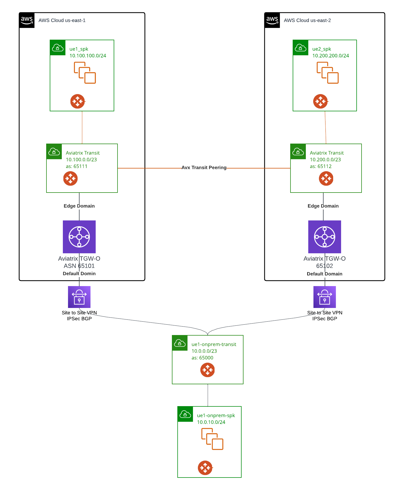

# terraform-aviatrix-edge-transit-tgwo-vpn-to-onprem
This module creates following architecture:

- Each region have an Aviatrix Spoke - Aviatrix Edge Transit - Aviatrix orchestrated TGW (TGW-O)
- In the bottom, another aviatrix transit and spoke acting as onprem
- Each TGW VPN to onprem Aviatrix transit via IPSec/BGP